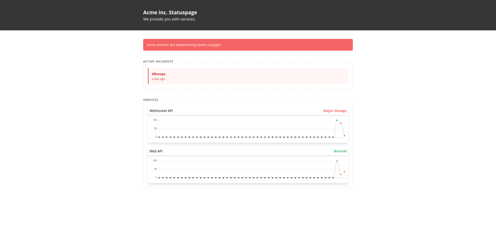

## About

StatusWatchdog is a modern, API-first self-hostable status page. The RESTful backend API is Swagger-documented and entirely usable on its own. Most deployments will probably choose to use the included Vue.JS based client application which it is configured to serve by default.

## Deployment

Navigate to the client application and build it with `npm run build` before running `dotnet publish -c Release` in the `src/StatusWatchdog.Api` directory.

Your built site + SPA will be located in `bin/Release/netcoreapp3.1/publish`. Follow the configuration guide in the following section before running the application.

## Setup & Development

You will likely want to customise your copy of StatusWatchdog (specifically the client UI). Before getting started, you should ensure your environment is properly configured:

```
.NET Core 3.1+
Node.JS 14+ (older versions may work)
PostgreSQL 10+ (older versions may work)
```

In order to function correctly, StatusWatchdog requires the following configuration parameters to be present:

```
PG_USERNAME (PostgreSQL username)
PG_PASSWORD (PostgreSQL password)
PG_DATABASE (PostgreSQL database)
API_KEY     (API key for authenticated endpoints)
```

These can be set via environment variables prefixed with `WATCHDOG_`, for example when run as a docker container. Additionally these values can be set in the `appsettings.json` configuration file, although this is not recommended for sensitive information.

## Documentation

If you are running the repository locally, using `dotnet run` - you will be able to access ReDoc API documentation from the `/docs` endpoint, and SwaggerUI documentation with Try It features on the `/swagger` endpoint. These are disabled when the application is deployed.

A static version of the documentation is WIP for when continuous integration is set up for the repository.

## UI Screenshots
**Current state of the project, more views and screenshots coming soon.**


